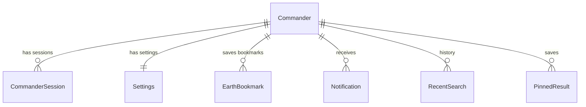

# THE MRIDANSH Headquarters Developer Guide

This document serves as the master technical developer guide for **THE MRIDANSH Headquarters (JCC Command Cockpit)**. It outlines the system architecture, file organization, database schemas, API registry, component library, utilities, and testing framework.

---

## Table of Contents
1. [System Architecture](#1-system-architecture)
2. [Folder Structure](#2-folder-structure)
3. [Environment Configuration](#3-environment-configuration)
4. [Database Schema & Models](#4-database-schema--models)
5. [Backend API Registry](#5-backend-api-registry)
6. [Frontend UI Component Library](#6-frontend-ui-component-library)
7. [Custom Frontend Hooks](#7-custom-frontend-hooks)
8. [Centralized Utilities System](#8-centralized-utilities-system)
9. [Automated Testing Infrastructure](#9-automated-testing-infrastructure)
10. [Local Development & Production Builds](#10-local-development--production-builds)

---

## 1. System Architecture

THE MRIDANSH Headquarters is built on a split client-server architecture designed for high performance, dynamic visualizations, and robust telemetry polling:

* **Backend Engine**: Built using [FastAPI](file:///d:/THE_MRIDANSH_HQ/backend/main.py) (ASGI server). It features custom ASGI middleware for request tracking (`x-request-id`), telemetry metrics logger intercepts, and Gzip response stream compression for payloads over 512 bytes.
* **Database Layer**: SQLite relational database managed via [SQLAlchemy v2](file:///d:/THE_MRIDANSH_HQ/backend/database/session.py) declarative ORM mappings. Structural schema migrations are automated via Alembic.
* **Frontend Cockpit**: Single Page Application built on [Next.js v15 App Router](file:///d:/THE_MRIDANSH_HQ/frontend/package.json) using React v19. Includes lazy-loading boundaries, Tailwind CSS design variables, and a custom presentational component library.

---

## 2. Folder Structure

```
THE_MRIDANSH_HQ/
├── backend/
│   ├── api/v1/                # Endpoint routers by module
│   │   ├── router.py          # Unified API router index mount
│   │   └── ...
│   ├── core/                  # Core config, security utilities, custom exception rules
│   ├── database/              # DB connection sessions, Alembic setup, schema migrations
│   ├── models/                # SQLAlchemy database model class definitions
│   │   └── models.py          # Database models index definitions
│   ├── repositories/          # CRUD DB transactions repository patterns
│   ├── schemas/               # Pydantic schema validation structures
│   ├── services/              # Third-party adapters (NASA, weather, GitHub, OpenAI)
│   └── main.py                # FastAPI app initialization, middleware, error handlers
├── frontend/
│   ├── app/                   # Next.js App Router folders
│   ├── components/            # Shared primitives library
│   │   └── ui/                # Presentational components (Button, Modal, dropdown, etc.)
│   ├── config/                # Central theme presets config registry
│   ├── contexts/              # Global contexts (ThemeContext, etc.)
│   ├── hooks/                 # Reusable client hooks (useAudio, usePolling, useTheme)
│   ├── services/              # API fetch adapter clients
│   ├── styles/                # Global layout styling and Tailwind imports
│   └── utils/                 # Frontend text helpers, storage, cookie/API adapters
├── tests/
│   ├── backend/               # Python unit test cases (TestAuth, TestSettings, etc.)
│   ├── frontend/              # Javascript logic and config contract tests
│   ├── run_backend_tests.py   # Isolated test runner using test_mridansh.db database
│   └── run_frontend_tests.js  # Node.js native test runner executing frontend suites
```

---

## 3. Environment Configuration

The configuration parameters are defined inside the root `.env` file. These are loaded on startup into Pydantic BaseSettings:

| Environment Variable | Description | Default / Example Value |
| :--- | :--- | :--- |
| `DATABASE_URL` | SQLAlchemy connection URL (SQLite locally) | `sqlite:///./mridansh.db` |
| `JWT_SECRET` | Secret key used to sign and verify JSON Web Tokens | `developer_secret_key_jcc_telemetry_jwt_access` |
| `SESSION_SECRET` | Secret key used for Starlette cookie session states | `developer_secret_key_jcc_telemetry_session_access` |
| `COMMANDER_USERNAME` | Administrator Username | `commander` |
| `COMMANDER_PASSWORD` | Administrator Password | `@mridansh1607x` |
| `NEXT_PUBLIC_API_URL` | Backend server endpoint accessed by client fetches | `http://localhost:8000` |
| `GLOBAL_MOCK_MODE` | Development flag to bypass outbound network integrations | `True` |

---

## 4. Database Schema & Models

All database models inherit from the SQLAlchemy declarative Base in [session.py](file:///d:/THE_MRIDANSH_HQ/backend/database/session.py) and are defined in [models.py](file:///d:/THE_MRIDANSH_HQ/backend/models/models.py).

### Schema Relationship Graph


### Table Mappings
1. **`commanders`**: Commander account registration metadata.
2. **`sessions`**: Active login sessions audit logs.
3. **`settings`**: Visual Theme Engine preference configurations (including custom accent overrides, opacity, glow, animation metrics, border radius, and font sizing bounds).
4. **`logs`**: Central ActivityLog telemetry audit trail.
5. **`security_events`**: Security alerts audit registers.
6. **`engine_logs`**: Engine thrust, fuel flow, coolant pressure, and magnetic suspension states.
7. **`research`**: Research Vault document indexes.
8. **`datasets`**: Dataset catalog file storage parameters.
9. **`experiments`**: Experiment status checkpoints.
10. **`earth_bookmarks`**: Map coordinates bookmarks.
11. **`notifications`**: Database notifications feeds.
12. **`recent_searches`**: Search history caches.
13. **`pinned_results`**: Global Search pinned elements records.

---

## 5. Backend API Registry

The backend exposes **15 sub-routers** under `/api/v1` mounted in [router.py](file:///d:/THE_MRIDANSH_HQ/backend/api/v1/router.py).

### Endpoints Index

#### Authentication (`/auth`)
* `POST /login`: Receives username and password JSON payload, sets secure cookie sessions, and returns authentication state.
* `POST /logout`: Clears session keys and registers session logout timestamps.

#### Settings (`/settings`)
* `GET /`: Retrieves settings profile.
* `PUT /`: Updates theme visual variables (validates bounds: opacity `[0.0, 1.0]`, glow `[0.0, 3.0]`, animation speed `[0.0, 3.0]`, and colors matching hexadecimal syntax).

#### Telemetry & Stats (`/system`)
* `GET /dashboard`: Consolidated dashboard metrics (CPU statuses, DB states, total research and datasets count).

#### Engine Room (`/engine`)
* `GET /status`: Computed engine telemetry.
* `POST /ignite`: Initiates ignition warmup sequence.
* `POST /shutdown`: Cools reactor back to standby state.
* `POST /emergency-stop`: Instantly cuts magnetic suspension containment fields and triggers pressure release.
* `POST /reset`: Resets core locks after emergency shutdowns.
* `POST /throttle`: Adjusts reactor thrust levels `[0.0, 100.0]`.
* `GET /logs`: Historical logs audit trail.

#### Earth Operations (`/earth`)
* `GET /bookmarks`: Returns saved coordinates pins.
* `POST /bookmarks`: Adds coordinates bookmark pin.
* `DELETE /bookmarks/{id}`: Deletes coordinates bookmark pin.

#### Radar Tracking (`/radar`)
* `GET /targets`: Scans active bearing targets.

#### Research Vault (`/research`)
* `GET /`: Returns research items lists.

#### Dataset Catalog (`/datasets`)
* `GET /`: Returns registered dataset files.

#### Experiment Lab (`/experiments`)
* `GET /`: Returns lab checkpoints status.

#### Operational Logs (`/logs`)
* `GET /`: Paginated logs lists (supports `limit`, `skip`, and category queries).

#### Security Center (`/security`)
* `GET /`: Paginated threat events list.
* `POST /`: Dispatches manual threat alert details.

#### Notifications Board (`/notifications`)
* `GET /`: Consolidates user notification items.
* `GET /unread-count`: Returns active unread count.

#### Global Search (`/search`)
* `GET /`: Queries query strings across research documents and datasets.

#### Integrations Diagnostics (`/integrations`)
* `GET /status`: Consolidated diagnostic state of external API providers.

#### Exception Diagnostics (`/system/errors`)
* `GET /trigger`: Helper to trigger specific exception codes to test middleware.

---

## 6. Frontend UI Component Library

The project contains a presentational UI library inside [frontend/components/ui/](file:///d:/THE_MRIDANSH_HQ/frontend/components/ui/).

### Primitives Reference & Usage Examples

1. **`Button`**: Form buttons supporting variants (`primary`, `secondary`, `outline`, `ghost`, `danger`) and loading state.
   ```tsx
   import { Button } from "@/components/ui/Button";
   
   <Button variant="primary" loading={false} onClick={() => alert("Nominal")}>
     Initiate Ignition
   </Button>
   ```
2. **`Modal`**: Base container modal layout.
   ```tsx
   import { Modal } from "@/components/ui/Modal";
   
   <Modal isOpen={true} onClose={() => {}}>
     <p>System Diagnostics Mode Active</p>
   </Modal>
   ```
3. **`Badge`**: Status badge tag widget.
   ```tsx
   import { Badge } from "@/components/ui/Badge";
   
   <Badge variant="success">LOCKED</Badge>
   ```
4. **`StatusIndicator`**: Minimal glow indicator beacon.
   ```tsx
   import { StatusIndicator } from "@/components/ui/StatusIndicator";
   
   <StatusIndicator status="online" label="Engine Room Core" />
   ```
5. **`Accordion`**: Collapsible data drawer lists.
6. **`Avatar`**: Avatar representation widgets.
7. **`Card`**: Styled panel dashboard containers.
8. **`Dialog`**: Composition wrapper modal confirming actions.
9. **`Dropdown`**: Action popover selection overlay widgets.
10. **`Input`**: Validated text inputs.
11. **`Navbar`**: Layout header headers bars.
12. **`Progress`**: Visual progress indicators.
13. **`Select`**: Dynamic dropdown select controls.
14. **`Sidebar`**: Layout sidebar navigators.
15. **`Tabs`**: Page sub-navigation tabs.
16. **`Textarea`**: Multi-line logs texts controls.
17. **`Toast`**: Status notification indicators.
18. **`Tooltip`**: Hover helper tags details.

---

## 7. Custom Frontend Hooks

Located inside [frontend/hooks/](file:///d:/THE_MRIDANSH_HQ/frontend/hooks/):

* **`useTheme`**: Returns the active visual theme state configuration values, providing functions to update specific visual settings variables.
* **`useAudio`**: Helper managing UI clicks sound effects, error alerts, and diagnostic sweeps audio files.
* **`useNotification`**: Subscribes components to dashboard alerts alerts.
* **`useLocalStorage`**: Safe state synchronization to browser local storage.

---

## 8. Centralized Utilities System

Located inside [frontend/utils/](file:///d:/THE_MRIDANSH_HQ/frontend/utils/):

* **`helpers.ts`**: Pure validators and formatters (`truncateString`, `slugify`, `capitalize`, `chunk`, `unique`, `sortBy`, `isValidCoordinates`, `isValidHexColor`).
* **`storage.ts`**: Safe cookie and local storage modifiers.
* **`api.ts`**: Unified query string builders and JCC standard API envelope error parsers.
* **`logger.ts`**: Custom client-side logging utility with severity level control.
* **`formatters.ts`**: Number, date, and uptime formatting utilities.
* **`env.ts`**: Safe environment variables resolver.

---

## 9. Automated Testing Infrastructure

Task 26 created a complete testing suite inside the root [tests/](file:///d:/THE_MRIDANSH_HQ/tests/) folder.

### Backend Automated Tests
* **Execution Runner**: [run_backend_tests.py](file:///d:/THE_MRIDANSH_HQ/tests/run_backend_tests.py)
* **Isolated Database**: Forces `DATABASE_URL=sqlite:///./test_mridansh.db` in the test runner environment. Recreates all table structures and seeds a test commander user (`commander` / `@mridansh1607x`) on startup.
* **Running Tests**: Starts uvicorn on port `8002` in a background subprocess, runs 23 tests checking API routing logic, and cleanly stops uvicorn and deletes `test_mridansh.db` on completion.

### Frontend Logic & Contracts Tests
* **Execution Runner**: [run_frontend_tests.js](file:///d:/THE_MRIDANSH_HQ/tests/run_frontend_tests.js)
* **Native TS Running**: Executes directly under Node.js v24 using the native `--experimental-strip-types` flag (with no external testing frameworks required).
* **Scope**: Verifies theme configuration objects definitions boundaries, formatting helper adapters logic, and hex code validations.

---

## 10. Local Development & Production Builds

### Dev Runbook
1. Run backend server:
   ```powershell
   cd backend
   .venv\Scripts\python -m uvicorn backend.main:app --reload --port 8000
   ```
2. Run Next.js frontend:
   ```powershell
   cd frontend
   npm run dev
   ```

### Production Compilation
Before deploying, compile the production bundles to verify compilation is warning-free:
```powershell
cd frontend
npm run build
```
On pre-build, Next.js copies Cesium static assets automatically from node modules into public assets folders.
